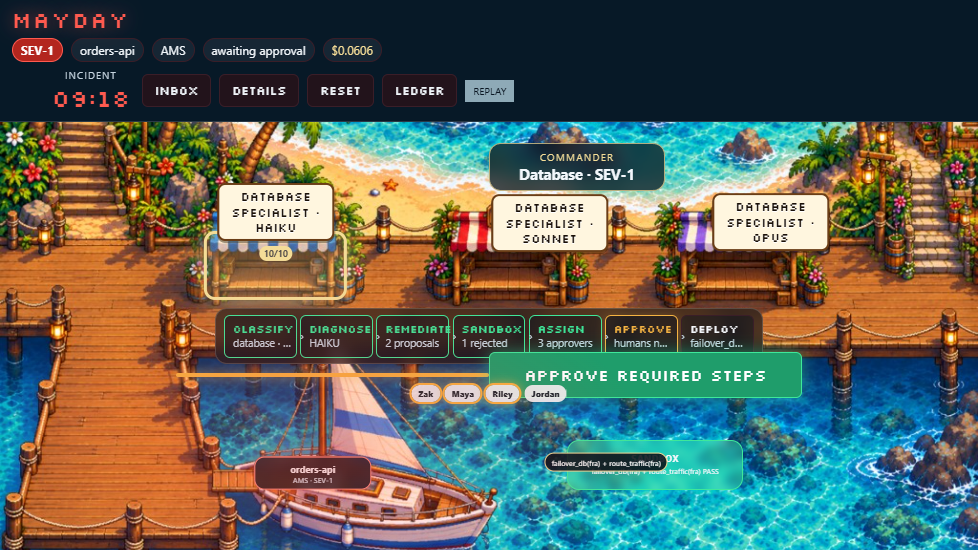
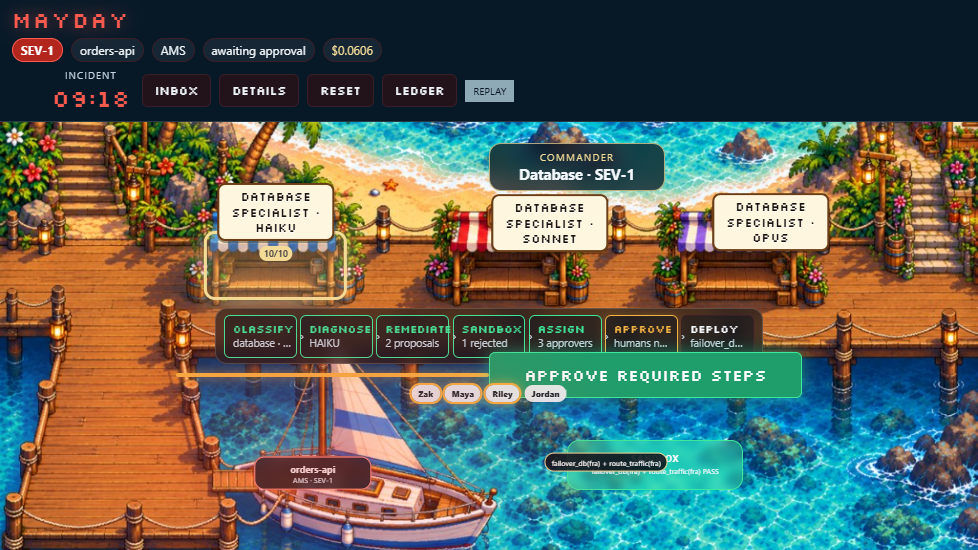
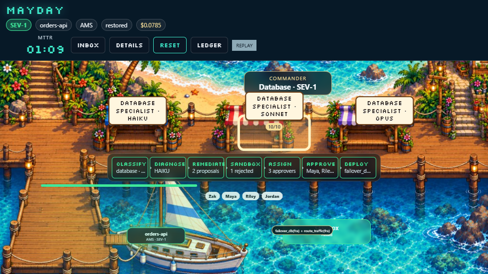

# MAYDAY

**AI Incident Command Center, powered by the Abyss Agent Market.**

Incidents from different systems arrive in one hub. An AI Commander reads a
compressed alert package, classifies the domain and severity, and dispatches
only the matching specialist market. Those specialists bid. The winner
diagnoses, then proposes an allowlisted remediation plan. A sandbox copy of
the service tests the plan. Humans who own each step must approve it before
anything reaches production.

The command center is the seaside harbor in `web/public/art/seaside-market.jpg`.
The painting is the scene, not a backdrop behind a dashboard.

| Place in the painting | What it shows |
|---|---|
| Boat | The incident that just arrived |
| Left stall | Haiku specialist |
| Center stall | Sonnet specialist |
| Right stall | Opus specialist |
| Main dock | Commander classification and the remediation pipeline |
| Water beside the dock | Sandbox. It flashes red on a rejected plan and green when the plan passes |
| Left glass panel | Incident inbox. Triggering an incident updates this same harbor |
| Right glass panel | Telemetry, human responders, approval, cost, and the investigation log |

Stall signs follow the Commander's domain: `Database Specialist · Haiku`, then
`Security Specialist`, `Networking Specialist`, or `Payments Specialist` for
the other markets. Inbox and detail panels collapse into drawers on narrower
windows so the stalls, boat, and dock stay readable. The earlier market
painting remains at `web/public/art/market.png` for the original `?app=market`
view.



## Demo sequence

1. Open the **incident inbox**. Four simulated sources are waiting.
2. Trigger **Orders DB · Amsterdam primary down**.
3. The Commander classifies it as `database` / SEV-1 from the compressed package.
4. Only Database Specialist · Haiku / Sonnet / Opus receive the full incident.
5. Diagnosis auction, then a repair auction. `restart_db(ams)` **fails the sandbox**.
6. The retry proposes `failover_db(fra) + route_traffic(fra)` and passes.
7. Maya (database), Riley (network) and Zak (SEV-1 commander) appear on the checklist.
8. Click **Approve Required Steps**. Production is updated and verified.
9. The dashboard shows MTTR, ledger cost, token-routing estimates and reputation
   (`agent + domain + task_type`).

Repeat with the auth attack (security → Sam) and the APAC network partition
(networking → Riley + Zak).

| Outage | Resolved |
|---|---|
|  |  |

## Setup

Requires Python 3.11+ and Node 20+.

```bash
cd backend
python -m venv .venv
.venv/Scripts/pip install -e ".[dev]"      # macOS/Linux: .venv/bin/pip
cd ../web
npm install
```

Copy `.env.example` to `.env` if you want local overrides. Never put keys in source.

## Run

**Replay** (no backend, no internet, no keys). Safest demo:

```bash
cd web
npm run dev
# http://localhost:5173/                  inbox: trigger a scenario, then Approve Required Steps
# http://localhost:5173/?auto=1&speed=2   plays the payments-pool recording straight through
```

**Fake live** (real backend and market, deterministic fake LLM, zero API cost):

```bash
cd backend
ABYSS_FAKE_LLM=1 .venv/Scripts/python -m uvicorn abyss.server:app --port 8000
# PowerShell: $env:ABYSS_FAKE_LLM="1"; .venv\Scripts\python -m uvicorn abyss.server:app --port 8000
cd ../web && npm run dev
# http://localhost:5173/?source=ws
```

**Real models.** Set `ANTHROPIC_API_KEY` in the environment (never commit it).
Without `ABYSS_REAL_MODELS=1`, every role still runs on Haiku:

```bash
ABYSS_REAL_MODELS=1 .venv/Scripts/python -m uvicorn abyss.server:app --port 8000
```

If a live Commander reply is invalid, deterministic rules take over. Severity
can never be downgraded below the rule result.

Other views: `?app=market` (original Abyss market, `fake_run.json`),
`?view=results`, `?ledger=1`, `?file=incident_ams_db_outage`.

## Docker

```bash
docker compose up --build
# UI: http://localhost:8080/
# API health: http://localhost:8000/health  or  http://localhost:8080/health
```

Compose starts fake-LLM mode by default. This repository is not claiming a
public cloud deployment.

## Test

```bash
cd backend && .venv/Scripts/python -m pytest -q
.venv/Scripts/python -m abyss.contract ../fixtures/fake_run.json
.venv/Scripts/python -m abyss.contract ../fixtures/incident_ams_db_outage.json
.venv/Scripts/python -m abyss.contract ../fixtures/incident_payments_pool.json
.venv/Scripts/python -m abyss.contract ../fixtures/incident_auth_attack.json
.venv/Scripts/python -m abyss.contract ../fixtures/incident_network_partition.json
cd ../web && npm test && npm run build
```

Regenerate recordings after a contract change:

```bash
backend/.venv/Scripts/python fixtures/make_incident_fixtures.py
backend/.venv/Scripts/python fixtures/make_fake_run.py
```

## Token and cost savings

Nothing on the dashboard is invented. **Actual** tokens, calls and dollars come
from the ledger (`routing_stats.actual_*`).

**Estimates** (labeled as estimates) are:

1. Commander package: `characters(commander prompt + compressed package) / 4`
   versus the same prompt with the full telemetry, logs, checks and allowlist.
2. Skipped specialists: for every auction, each specialist in another domain
   would have received a bid prompt. Those input tokens are priced at that
   model's input rate.

`avoided_input_tokens_est` and `avoided_cost_usd_est` are the sum of (1) and
(2). They measure routing, not model quality.

## Safety

- AI output is never executed. Every remediation is parsed into typed steps and
  checked against that scenario's allowlist.
- The sandbox applies the plan to a deep copy. Production changes only after
  `approve_repair`.
- Human assignment is rule-based: database → Maya, routing → Riley (or Alex),
  security → Sam, customer comms → Jordan, SEV-1 sign-off → Zak.
- Secrets come only from environment variables and are never logged.

## How it's built

The Abyss auction, work/review calls, ledger, WebSocket validator and replay
are unchanged. MAYDAY adds:

- `backend/abyss/commander.py` — compressed package, classification, dispatch
- `backend/abyss/scenarios.py` — four deterministic incidents
- `backend/abyss/incident.py` — typed allowlist, sandbox, scenario interface
- `backend/abyss/responders.py` — paging and step ownership
- `backend/abyss/mayday.py` — Commander → market → sandbox → humans → verify
- `web/src/ui/mayday/` — seaside command center. `SeasideScene` places live state on the harbor painting; the glass drawers read the same events

The contract is in [SPEC.md](SPEC.md) (§11).
