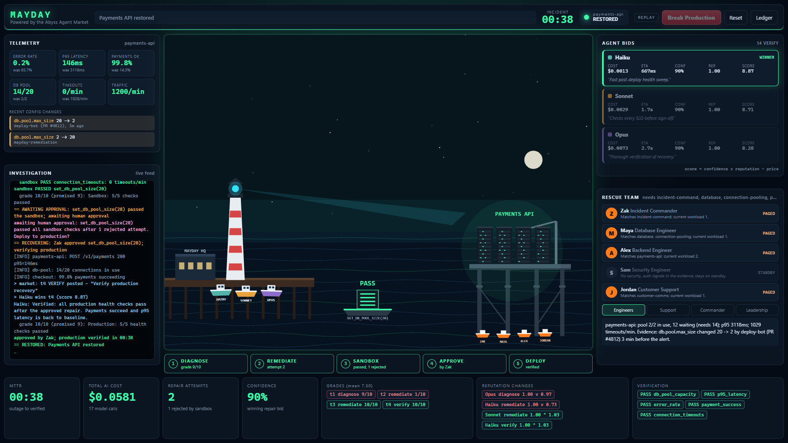
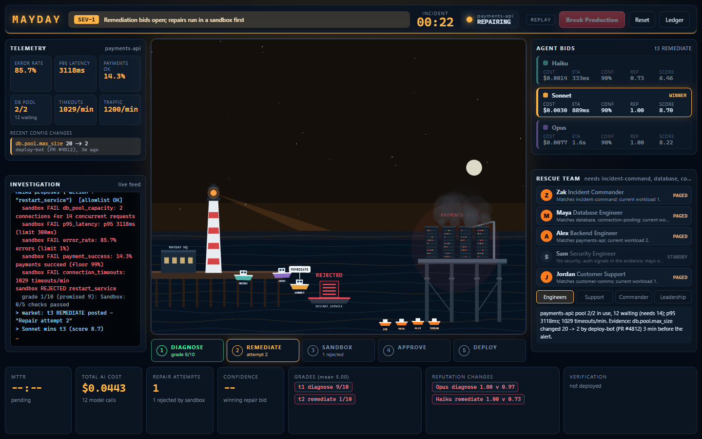
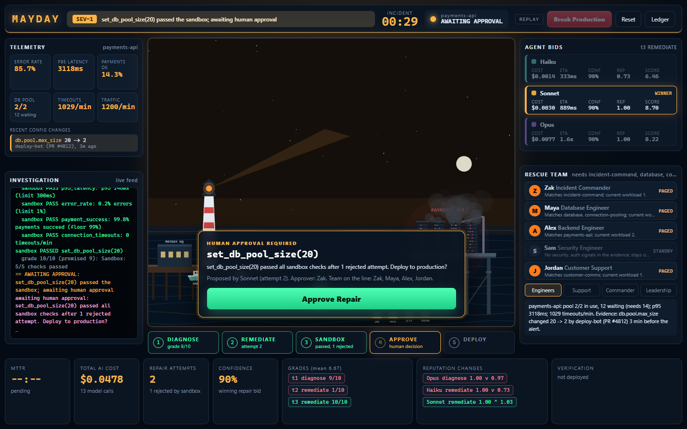

# MAYDAY

**AI incident response, powered by the Abyss Agent Market.**

Production breaks. Three AI agents (Haiku, Sonnet, Opus) bid on each step of the response: cost, confidence, ETA and promised quality, weighted by the reputation they have earned. The winner diagnoses the outage and proposes a repair. The repair is a strict JSON action from an allowlist. It is tested in a sandbox copy of production and is never executed as code. A human approves the deployment, and deterministic health checks decide when the service is actually restored. Every grade feeds back into per-task-type reputation, so an agent that over-promises loses future auctions.



| Outage and sandbox rejection | Human approval |
|---|---|
|  |  |

The demo sequence is: Break Production → failures, logs, metrics and a SEV-1 → three diagnosis bids → diagnosis winner → remediation bids → the first repair (`restart_service`) fails the sandbox → the second (`set_db_pool_size(20)`) passes → the right rescue team is paged → a human clicks **Approve Repair** → the service recovers → MTTR, AI cost, repair attempts, confidence, grades and reputation changes.

The original Abyss job market (research → writing → checking) is still there at `?app=market`.

## Setup

Requirements: Python 3.11+, Node 20+.

```powershell
# backend
cd backend
python -m venv .venv
.\.venv\Scripts\python -m pip install -e ".[dev]"     # macOS/Linux: .venv/bin/python

# frontend
cd ..\web
npm install
```

## Run it

### 1. Replay: no backend, no keys, no internet

```powershell
cd web
npm run dev
# open http://localhost:5173/
```

This plays `fixtures/mayday_run.json`. The replay is interactive, just like the live app: it waits for **Break Production**, pauses at **Approve Repair**, and **Reset** starts it over.

URL options:
- `?speed=3`: plays 3× faster.
- `?auto=1`: plays through without waiting for clicks.
- `?ledger=1`: opens the ledger panel.
- `?file=fake_run&app=market`: the original market replay.

### 2. Live backend with the fake LLM: deterministic, free, offline

```powershell
cd backend
$env:ABYSS_FAKE_LLM = "1"          # bash: export ABYSS_FAKE_LLM=1
.\.venv\Scripts\python -m uvicorn abyss.server:app --port 8000

cd ..\web
npm run dev
# open http://localhost:5173/?source=ws
```

Optional: `ABYSS_FAKE_DELAY=0.4` sets the seconds per fake model call, and `ABYSS_LEDGER_PATH` / `ABYSS_REP_PATH` keep test runs out of `runs/`.

### 3. Real models (costs money)

```powershell
$env:ANTHROPIC_API_KEY = "<your key>"   # never commit it
# Default is "Haiku test mode": every call goes to claude-haiku-4-5 (cheap).
.\.venv\Scripts\python -m uvicorn abyss.server:app --port 8000
# Real per-agent models (Haiku / Sonnet / Opus) for the demo:
$env:ABYSS_REAL_MODELS = "1"
```

The header badge always shows the mode (REPLAY, FAKE LLM, HAIKU TEST MODE or LIVE MODELS). With real models, the remediation still has to parse into one of the three allowlisted actions. Anything else is rejected and shown as a failed sandbox attempt.

## Verify

```powershell
cd backend
$env:ANTHROPIC_API_KEY = ""
.\.venv\Scripts\python -m pytest -q
.\.venv\Scripts\python -m abyss.contract ..\fixtures\fake_run.json     # OK 37 events
.\.venv\Scripts\python -m abyss.contract ..\fixtures\mayday_run.json   # OK 60 events
.\.venv\Scripts\python ..\fixtures\make_fake_run.py                    # regenerates both fixtures

cd ..\web
npm test
npx tsc --noEmit
npm run build
```

## How it works

| piece | where |
|---|---|
| Event contract (Pydantic plus stream validator) and its TS mirror | `backend/abyss/contract.py`, `web/src/contract.ts`, `SPEC.md` §7.5 |
| Payments API simulator, action allowlist, sandbox, health checks | `backend/abyss/incident.py` |
| Rescue-team selection and audience briefings | `backend/abyss/responders.py` |
| Incident workflow (it reuses the market's auction, work and review unchanged) | `backend/abyss/mayday.py` |
| WebSocket messages `start_incident`, `approve_repair`, `reset_incident` | `backend/abyss/server.py` |
| Dashboard, Pixi harbor scene, pure view model | `web/src/mayday/` |
| Deterministic fixtures | `fixtures/make_fake_run.py` |

Safety rules: no model output is ever executed; remediations are validated against a three-action allowlist; every repair is sandboxed before a human approves it; no secrets live in source or logs. Every metric on screen comes from events (ledger costs, the simulator's telemetry, measured MTTR); none are hardcoded.
